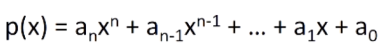

# Unit 2: Simple programs

# Lecture 3: Simple algorithms

---
---
## 2.0 So far...

In the last lecture, we added looping variants.  We saw `for` loops, `while` loops, and touched on the notion of iteration, using it to start generating some examples of guess-and-check algorithms.  In this lecture, we're going to go back to those ideas, but extend them.  We're going to add in a new data type, strings, and look at ways of using them to generate algorithms of higher complexity.  

---
### Reviewing loops
---

```python
ans = 0
neg_flag = False
x = int(input('Enter an integer: '))

# Check for negative inputs
if x < 0:
    neg_flag = True

# Find square root by running through a loop
while ans**2 < x:
    ans = ans+1

if ans**2 == x:
    print('Square root of', x, 'is', ans)
else:
    print(x, 'is not a perfect square')

    # Handle negative inputs
    if neg_flag:
        print('Just checking...did you mean ' + str(-x) + '?')
```

This code generates values for the answer until we get to a point where the answer is correct or we've gone too far.  Note how we are setting up the variable outside the loop and changing the variable inside the loop with a test that depends on it.  

---
### Reviewing strings
---

- think of strings as a **sequence** of case-sensitive characters
- can compare strings using `==`, `<`, `>` operators, etc.
- `len()` is a function used to retrieve the **length** of the string in parentheses
- square brackets are used to perform **indexing** into a string to get the value at a certain index/position
    - `s = 'abc'`
    - `len(s)` -> evaluates to `3`
    - `s[0]` -> evaluates to `'a'`
    - `s[3]` -> throws an `IndexError`, indexing out of bounds
- can **slice** strings using `[start:stop:step]`
    - `s = abcdefgh`
    - `s[::-1]` -> evaluates to `'hgfedcba'`
    - `s[3:6]` -> evaluates to `'def'`
    - `s[-1]` -> evaluates to `'h'`
- strings are **immutable**—cannot be modified
    - `s = 'hello!'`
    - `s[0] = 'y'` -> throws a `TypeError`, object does not support item assignment
    - `s = 'y'+s[1:len(s)]` -> is allowed as we are reassigning variable `s` to a new object in this case

---
### `for` loops recap
---

- `for` loops have a **loop variable** that iterates over a set of values
```python
# e.g.
for var in range(4):
    <expressions>
```
- in the above, `var` iterates over values `0`, `1`, `2`, `3`
- expressions inside loop executed with each value for `var`
```python
# e.g.
for var in range(4, 8):
    <expressions>
```
- in the above, `var` iterates over values `4`, `5`, `6`, `7`

> - `range` is a way to iterate over numbers, but a `for` loop variable can iterate over any set of values—not limited to just numbers!

---
### Strings and loops
---

```python
s = 'abcdefgh'
for index in range(len(s)):
    if s[index] == 'i' or s[index] == 'u':
        print("There is an 'i' or a 'u' in this string!")

# The above could also be written as such:
for char in s:
    if char == 'i' or if char == 'u':
        print("There is an 'i' or a 'u' in this string!")
```

When we structure a loop as `for char in s`, `s` is in this context is something we call an *iterable*.  This means that we can loop through each element of `s`, performing the same test as we move along until we run out of elements and exit the loop.  This is much cleaner code compared to the first example—it really contributes to the readability of that what we're doing with that block.  

We can iterate over *anything* where we can successively enumerate each of the elements of it.  

---
---
## 2.1 Approximate solutions

- suppose we want to find the root of any non-negative number?  could be an integer, a float—we can't generate all possible guesses because they're infinite
- we can't guarantee an exact answer, but we can just look for something that's close enough
- start with exhaustive enumeration
    - pick examples where we can take small steps to generate guesses in order
    - check to see if close enough

- we have to define what's a *good enough* solution
- start with a guess and increment by some **small value**
- e.g., `abs(guess**3) - cube <= epsilon` for some small `epsilon`

> - we have to deal with a tradeoff here:
>    - decreasing the increment size results in an increasingly slower program
>    - increasing epsilon results in an increasingly less accurate answer
> - we also gain a distinct advantage over previous examples of calculating cube roots:
>    - we can now approximate the cube root as a float and find cube roots that aren't "perfect" integers

```python
cube = 29
epsilon = 0.01
guess = 0.0
increment = 0.01
num_guesses = 0

# Second condition of the loop prevents us from looping infinitely if we step over cube
while abs(guess**3 - cube) >= epsilon and guess <= cube:
    guess += increment
    num_guesses += 1
print('Number of guesses =', num_guesses)

if abs(guess**3 - cube) >= epsilon:
    print('Failed on the cube root of', cube)
else:
    print(guess, 'is close to the cube root of', cube)
```

---
### Some observations
---

- step could be any small number
    - if too small, takes a long time to find the root
    - if too large, we might skip over the answer because we weren't able to get close enough to it
- in general, it will take `x/step` times through the code to find a solution
    - might need a more efficient way of doing this, still!

---
---
## 2.2 Bisection search

So far, we've been exploring exhaustive guess-and-check algorithms.  These worked fairly well when we were dealing with integers as that allows us to explore a finite number of solutions, but we also saw how they broke down when we looked at, for example, finding square roots and cube roots of numbers that aren't perfect squares or cubes.  We then generalized to look at something that does a different kind of guess and check where we take incremental steps, enumerating all the possibilities within the resolution of that step, trying to find a solution.  In doing this, we either took very small steps and a lot of time *or* larger steps that possibly skipped over the solution.  We still want to find a more effective way of doing things!  

Let's think about square/cube roots again.  One thing we know about the square/cube root of a number, `x`, is that the square/cube root lies somewhere between `1` and `x` (assuming the number is `>= 1`).  

- rather than trying to enumerate all possible solutions between `1` and `x`, suppose we instead pick a number in the **middle** of this range
    - if we're extremely *lucky*, this answer is close enough
        - if we're not close enough with that initial guess, we can still determine whether the guess was **too big or too small**
            - we can then use this info as parameters for a new range, and we repeat the process of taking a number in the middle of the decided range and asking the question over again
                - we can repeat all of this process until we've converged on the search item
- this is a really amazing thing, because at each step of the way, we're throwing away half of the things we don't have to look at anymore!
    - that's going to, hopefully, allow us zero in on the right solution *really* quickly

Let's look at this in code:  
```python
# Square root
x = 25
epsilon = 0.01
numGuesses = 0
low = 1
high = x
ans = (high+low)/2.0

while abs(ans**2 - x) >= epsilon:
    print('low = ' + str(low) + ', high = ' + str(high) + ', ans = ' + str(ans))
    numGuesses += 1
    if ans**2 < x:
        low = ans
    else:
        high = ans
    ans = (high+low)/2.0
print('\n' + 'guesses = ' + str(numGuesses))
print(str(ans) + ' is close to the square root of ' + str(x))
```

```python
# Cube root
x = 27
epsilon = 0.01
numGuesses = 0
low = 1
high = x
ans = (high+low)/2.0

while abs(ans**3 - x) >= epsilon:
    print('low = ' + str(low) + ', high = ' + str(high) + ', ans = ' + str(ans))
    numGuesses += 1
    if ans**3 < x:
        low = ans
    else:
        high = ans
    ans = (high+low)/2.0
print('\n' + 'guesses = ' + str(numGuesses))
print(str(ans) + ' is close to the cube root of ' + str(x))
```

Remember when we used guess-and-check to search for the square root of `25` with the same `epsilon` value?  It took us 30,000 guesses.  
With bisection search, we converge on a solution in *12* guesses.  Wow.  

---
### Bisection search convergence
---

- search space
    - first guess: `N/2`
    - second guess: `N/4`
    - `g`th guess: `N/2**g`
- guess converges on the order of `math.log(N,2)`
- bisection search works when value of function varies monotonically with input
- code shown only works with positive cubes that are >1 ... why?
    - challenges:
        - modify to work with negative cubes
        - modify to work with `x>1`

---
### `x < 1` and/or `x < 0`
---

- if `x < 1`, search space is `0` to `x`, but cube root is greater than `x` and less than `1`
    - using this knowledge, we can modify the code to change the search space depending on the value of `x`

```python
"""
This version handles inputs less than 1
"""
x = -0.2
epsilon = 0.01
numGuesses = 0
low = 1
high = abs(x)

# Handle cases for 0 < x < 1 or -1 < x < 0
if abs(x) > 0 and abs(x) < 1:
    low = x
    high = 1

if x != 0:
    ans = (high + low)/2.0

    while abs(ans**3 - abs(x)) >= epsilon:
        print('low = ' + str(low) + ', high = ' + str(high) + ', ans = ' + str(ans))
        numGuesses += 1
        if ans**3 < abs(x):
            low = ans
        else:
            high = ans
        ans = (high + low)/2.0
else:
    ans = 0

# Handle negative values for x
if x < 0:
    ans = -abs(ans)
print('\n' + 'guesses = ' + str(numGuesses))
print(str(ans) + ' is close to the cube root of ' + str(x))
```

---
### Some observations
---

- bisection search radically reduces computation time
    - being smart about generating guesses is important
- should work well on problems with "ordering" property
    - value of function being being solved varies monotonically with input value (increases as the input value increases)
        - here, function is `g**2`, which grows as input grows

---
---
## 2.3 Floats and fractions

### Dealing with `float`s
---

- `float`s approximate real numbers, but it's useful to know and understand *how*
    - machine can't store an infinite number of decimal points or digits after the decimal
- decimal number:
    - `302` is `3*10**2 + 0*10**1 + 2*10**0`
- binary number:
    - `10011` is `1*2**4 + 0*2**3 + 0*2**2 + 1*2**1 + 1*2**0`
    - which in decimal is `16 + 2 + 1 = 19`
- internally, computer represents numbers in binary, whether integer or float

---
### Converting decimal integer to binary
---

- consider `x = 1*2**4 + 0*2**3 + 0*2**2 + 1*2**1 + 1*2**0 = 10011`
- if we take the remainder relative to `2` (`x%2`) of this number, that gives us the last binary bit
- if we then divide `x` by `2`, (`x//2`), all the bits get shifted right
    - `x//2 = 1*2**3 + 0*2**2 + 0*2**1 + 1*2**0 = 1001`
- keep doing successive divisions; now remainder gets next bit, and so on
- lets us convert to binary form

---
### Doing this in Python
---

```python
if num < 0:
    isNeg = True
    num = abs(num)
else:
    isNeg = False
result = ''
if num == 0:
    result = '0'
while num > 0:
    result = str(num%2) + result
    num = num//2
if isNeg:
    result = '-' + result
print(result)
```

Alright, cool!  So we can take integers and convert them into binary... We were talking about floats, though!  
- So how do I deal with the fraction part of this?
- Turns out, we can do almost the same thing—let's look at an example:
    - `3/8 = 0.375` is `3*10**(-1) + 7*10**(-2) + 5*10**(-3)`
    - so if we multiply by a power of two big enough to convert into a whole number, can then convert to a binary, and then divide by the same power of two
        - `0.375 * 2**3 = 3` (in decimal)
        - convert `3` to binary now (now `11`)
        - divide by `2**3` (shift right) to get 0.011 (binary)
    - here's the code to do just that:

```python
# Initialize variables
x = float(input('Enter a decimal number greater than 0: '))
p = 0

# Multiply by a power of 2 big enough to convert to a whole number
while ((2**p)*x)%1 != 0:
    p += 1
    print('Remainder = ' + str((2**p)*x - int((2**p)*x)) + ', Exponent = ' + str(p))

# Capture the whole number as a variable
num = int((2**p)*x)

# Convert the whole number to binary representation
result = ''
if num == 0:
    result = '0'
while num > 0:
    result = str(num%2) + result
    num = num//2

# Shift the binary representation right to transform to the correct binary decimal
for i in range(p - len(result)):
    result = '0' + result

# Place the decimal point
if (x-1.0) < 1E-10:
    result = '1'
else:
    result = result[0:-p] + '.' + result[-p:]
print('The binary representation of the decimal ' + str(x) + ' is ' + str(result))
```

- this helps us to see how you might get back a float you weren't expecting at times—in the binary representation of what you're expecting, we might be able to get close but not *quite* to a place of exactness
- with that, we now have a way of understanding how we can represent floating point numbers inside a machine where everything is stored in terms of binary bits

---
### Some implications
---

- if there is no integer `p` such that a power of `2` multiplied by `x` is a whole number, then internal representation is always an approximation
- suggests that testing equality of floats is **not** exact—using `==` is asking the question, "is the binary representation the same for these?"
    - it might not be!  it might just be really close!
        - therefore, we're always better off using the absolute value of the difference of two `float`s—is it smaller than some small number:
        - `abs(x-y) < z` (where `z` is some small number)
- why does `print(0.1)` return `0.1` if not exact?
    - Python designers set it up this way to automatically round

---
---
## 2.4 Newton-Raphson

- general approximation algorithm to find roots of a polynomial in one variable

- want to find `r` (root) such that `p(r) = 0`
- e.g., to find the square root of `24`, find the root of `p(x) = x**2 - 24`
- Newton showed that, if `g` is an approximation to the root, then `g - p(g)/p'(g)` is a better approximation (where p' is derivative of `p`)
    - i.e., if `g` is a good guess to that root, you can get an even better guess by taking `g` and subtracting it from the polynomial evaluated at `g` divided by the derivative of the polynomial evaluated at `g`
- Newton-Raphson will apply to any polynomial

---
### Simple case
---
- e.g., `cx**2 + k`
- first derivative: `2cx`
- if polynomial is `x**2 + k`, derivative is just `2x`
- so, Newton-Raphson says, given a guess `g` for a root, a better guess is `g - (g**2 - k)/2g`

- this gives us another way of generating guesses, which we check and which is very efficient
```python
epsilon = 1E-3
y = 24.0
guess = y/2.0
numGuesses = 0

while abs(guess*guess - y) >= epsilon:
    numGuesses += 1
    guess = guess - (((guess**2) - y)/(2*g))

print('Number of guesses = ' + str(numGuesses))
print('Square root of ' + str(y) + ' is about ' + str(guess))
```
- this gives us a solution in just 4 guesses!
- even bisection search was about 15-20 guesses, so this is a really cool improvement

---
### Iterative algorithms
---

- now, what we've seen is that guess and check methods build on reusing the same code over and over again
    - use a looping construct to generate guesses, then check and continue
- generating guesses
    - exhausive enumeration
    - bisection search
    - Newton-Raphson (for root-finding)