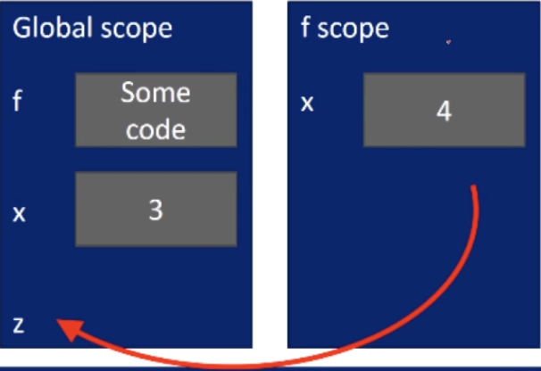
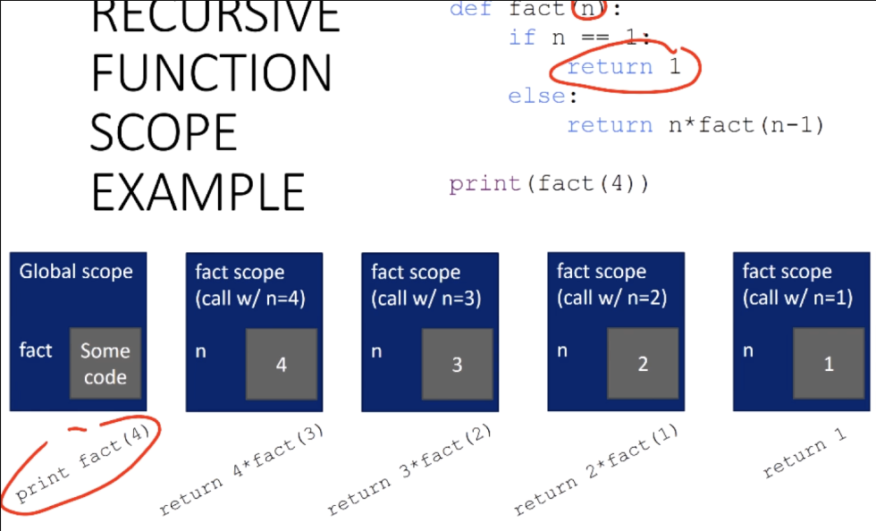
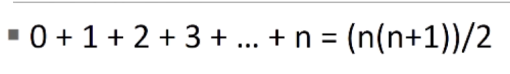
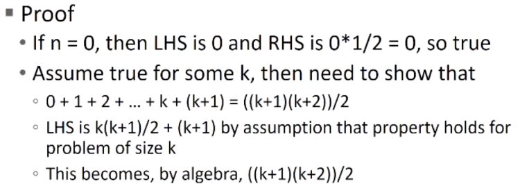

# Unit 2: Simple programs

# Lecture 4: Functions

---
---
## 2.5 Decomposition and abstraction

### How do we write code?
---

- so far...
    - covered language mechanisms
    - know how to write different files for each computation
    - each file is some piece of code
    - each code is a set of instructions
- problems with this approach
    - easy for small-scale problems
    - messy for larger problems
    - hard to keep track of details
    - how do we know the right info is supplied to the right part of code?

---
### Good programming
---

- more code not necessarily a good thing
- measure good programmers by the amount of functionality
- introduce **functions**
    - encapsulate pieces of computation
- mechanism to achieve *decomposition* (a.k.a modularity) and *abstraction*

---
### Example/analogy — projector
---

- a projector is a black box
    - don't know how it works, construct whose details we don't understand
    - we do know the interface: input/output
        - this interface is a standard interface—can connect any electronics to it that can communicate with that input for the purpose of producing an output
            - black box somehow converts image from input source to a projection on a wall, magnifying it
> - **abstraction idea**: do not need to know how a projector works to use it

- projecting large image in an event such as the Olympics opening ceremony decomposed into separate tasks for separate projectors
    - each projector takes input and produces separate output
    - all projectors work together to produce a larger image
> - **decomposition idea**: different devices work together to achieve an end goal

---
### Apply these ideas to programming
---

- **decomposition**
    - break problem into different, self-contained pieces
- **abstraction**
    - suppress details of method to compute something from use of that computation

---
### Create structure with decomposition
---

- building on same example of multiple, separate devices
- in programming, divide code into **modules**
    - are **self-contained**
    - used to **break up** code
    - intended to be **reusable**
    - keep code **organized**
    - keep code **coherent**
- goals:
    - this lecture, achieve decomposition with functions
    - in a few weeks, achieve decomposition with classes

---
### Suppress details with abstraction
---

- in example, no need to know how to build a projector
- in programming, can think of a piece of code as a black box
    - do not need to see details
    - do not want to see details
    - hide tedious coding details
- goal:
    - achieve abstraction with **function specifications** or **docstrings**

---
### Decomposition and abstraction
---

- powerful together
- code can be used many times but only has to be debugged once

---
---
## 2.6 Introducing functions

### Functions
---

- reusable pieces/chunks of code
- functions are not run in a program until they are "called" or "invoked"
- function characteristics:
    - has a **name**
    - has **parameters** (0 or more)
    - has a **docstring** (technically optional documentation that describes what the function does)
    - has a **body**, the sequence of commands/instructions to run when function is called

---
### How to write and call/invoke a function
---

```python
def is_even(i):
    """
    Input: i, a positive int
    Returns True if i is even, otherwise False
    """
    print('hi')
    return i%2 == 0

is_even(3)
```

- in this small example, we can see in the top line:
    - `def` is the keyword we use to begin **defining** the function
    - `is_even` is the **name** of the function, a string of our choosing
    - `i` is the single **parameter** for this function, and we're giving this a name (think of it like a variable name)
    - the `:` at the end finishes off the top line, where we've defined the function
- immediately below the top line, in triple double quotes, is the **docstring**
    - it's up to us how to use this, but traditionally we would use this to specify the intended inputs and outputs for the function
        - we can think of this as a bit like a *contract*
    - a nice thing about docstrings is that our editors/IDEs show them when we go to call our function, which is a nice little reminder for the conditions of the function
- below the docstring is the body of the function
    - this is the sequence of commands or expressions we want to evaluate when we're ready to use this function
    - notice the indentation, as this is telling us where the body of the function is, and where the function ultimately ends
    - the body in this particular example is simply going to print out the string `hi` and **return** a value—we'll get back to this return value in a second...

So, there's our function...how do we use it?  
Well, the function has a name, so we can use that inside an expression such as we would a variable!  

In particular, later on in the code, we can say an expression like `is_even` with parentheses that contain the parameters we'd like to pass to the function.  

So, calling this function looks like this: `is_even(3)`  
In passing that value, `3`, to the function, we're effectively going to be using it everywhere we see an `i` in the body of the function.  

In the last line of the code, we see the keyword `return`, which tells us we're ready to stop the computation; the value of the expression on that line is the **return value**—we can think of this as the final value that we're "handing back" in executing the function.  

In this case, we simply handed this value back to the shell, but we'll soon see how these return values can be used as part of another computation.  

---
---
## 2.7 Calling functions and scope

### Variable scope
---

- **formal parameter** gets bound to the value of **actual parameter** when function is called
- new **scope**/**frame**/**environment** created when we enter a function
- **scope** is mapping of names to objects

```python
def f(x):
    x = x + 1
    print('In f(x): x = ', x)
    return x
x = 3
z = f(x)
```

- in this example:
    - formal parameter is `x` in the function definition, `def f(x)`
    - when we call the function, we're creating a new environment (a.k.a. frame or scope); a new place in which we're going to bind variables, relative to which we're going to evaluate the body of the function
        - once again, think of this scope as a *mapping of names to objects* 
        - when we bind the value `3` to the *variable* `x`, we're doing so in the **global** scope
        - then, our **actual** parameter is `x` in `z = f(x)`



- the important concept to understand here is that anytime we do an invocation of a function, we create a new frame
    - we bind the formal parameter(s) of that function to the values of the expressions passed in
    - relative to that new frame we've created, we evaluate the body of that expression
    - when we're done with the body of the function, if there's a return, we send the value back wherever it was requested and erase or remove that frame because we no longer need it

---
### One warning: if no `return` statement
--- 

```python
def is_even(i):
    """
    Input: i, a positive int
    Does not return anything
    """
    i%2 == 0
```

- Python returns the value `None` if no `return` given
    - represents the absence of a value

---
### Return vs. print
---

| return | print |
| --- | --- |
| return only has meaning **inside** a function | print can be used **outside** functions |
| only **one** return executed inside a function | can execute **many** print functions inside a function |
| code inside function but after return statement not executed | code inside function can be executed after a print statement |
| has a value associated with it, **given to function caller** | has a value associated with it, **outputted to console** |

- prints are handy in that we can have them pass information back to us to let us know the status of a computation
- return is the way in which we're going to get a value back to something that's asked for it (whether that's us, the user, or some other function call)

---
### Functions as arguments
---

- arguments can take on any type, even functions
```python
# No parameters
def func_a():
    # Side effect
    print('inside func_a')

# One parameter
def func_b(y):
    # Side effect
    print('inside func_b')
    return y

# One parameter which is another function
def func_c(z):
    # Side effect
    print('inside func_c')
    return z()

# Important to think of this as printing the return for invocation of func_a
print(func_a())
print(5 + func_b(2))
print(func_c(func_a))
```

---
### Scope example
---

- inside a function, can **access** a variable defined outside
- inside a function, **cannot modify** a variable defined outside

```python
def f(y):
    x = 1
    x += 1
    print(x)

x = 5
f(x)
print(x)
```
- this snippet prints `2` and then `5`
- `x` is re-defined in the scope of `f`
- different `x` objects inside vs. outside function scope

```python
def g(y):
    print(x)
    print(x + 1)

x = 5
g(x)
print(x)
```
- prints `5`, `6`, and then `5` (`x` outside `g`)
- `x` inside `g` is picked up from scope that called function `g`
- despite there being no `x` as a *parameter* to `g`, i.e. the function can't find it in the frame, it will look outside

```python
def h(y):
    x = x + 1

x = 5
h(x)
print(x)
```
- throws `UnboundLocalError` as local variable `x` is referenced before assignment
- can look up the values of things outside scope, but cannot change the values of those things outside the scope appropriately

---
### Harder scope example
---

```python
def g(x):
    def h():
        x = 'abc'

    x = x + 1
    print('in g(x): x =', x)
    h()
    return x

x = 3
z = g(x)
```
- `h` is what's known as a **helper** function here—it only exists in the scope of `g`

---
---
## 2.8 Keyword arguments

### Keyword arguments and default values
---

```python
def printName(firstName, lastName, reverse):
    if reverse:
        print(lastName + ', ' + firstName)
    else:
        print(firstName, lastName)
```

```python
def printName(firstName, lastName, reverse=False):
    if reverse:
        print(lastName + ', ' + firstName)
    else:
        print(firstName, lastName)

printName('Eric', 'Grimson')
printName('Eric', 'Grimson', True)
```
- if we give a default value to our function for a parameter, we can *either* leave that parameter out of an invocation of that function (which will then use the default value for that invocation) *or* give it an explicit value to overwrite the default value
- please note, PEP 8 convention is to *not* use spaces around the `=` when indicating a keyword argument, or when indicating a default value for an unannotated function parameter

---
---
## 2.9 Specification

- a **contract** between the implementer of a function and the clients who will use it
    - **assumptions**: conditions that must be met by clients of the function; typically constraints on values of parameters
    - **guarantees**: conditions that must be met by function, providing it has been called in a manner consistent with assumptions

- the way we do this in Python is through the use of a docstring
    - let's consider how this relates to our previous example:
```python
def is_even(i):
    """
    Input: i, a positive int
    Returns True if i is even, otherwise False
    """
    print('hi')
    return i%2 == 0

is_even(3)
```

- you're not required to add a docstring/specs to your functions, but **Dr. Eric Grimson says that good programmers *always* do**
    - this is, in part, due to the fact that someone else might use your code in a professional setting or otherwise
    - it also simply helps us to remember what's expected of a piece of code and where we can use it ourselves after time has passed

---
---
## 2.10 Iteration vs. recursion

### What is recursion?
---

- a way to design solutions to problems by **divide-and-conquer** or **decrease-and-conquer**
- a programming technique where a **function calls itself**
- in programming, goal is to **not** have infinite recursion
    - must have 1 or more **base cases** that are easy to solve
    - must solve the same problem on **some other input** with the goal of simplifying the larger problem input

---
### Iterative algorithms so far
---

- looping constructs (while and for loops) lead to **iterative** algorithms
- can capture computation in a set of **state variables** that update on each iteration through the loop

---
### Multiplication — iterative solution
---

- multiplying `a * b` is equivalent to adding `a` to itself `b` times
- capture **state** by:
    - an iteration number, `i`, starts at `b`
        - `i` decrements and stops at `0`
    - a current **value of computation** (`result`)
        - `result = result + a`
```python
def mult_iter(a, b):
    result = 0
    while b > 0:
        result += a
        b -= 1
    return result
```

---
### Multiplication — recursive solution
---

- **recursive step**
    - think about how to reduce the problem to a smaller, simpler version of the same problem
- **base case**
    - keep reducing problem until we reach a simple case that can be **solved directly**
    - when `b = 1`, `a * b = a`
```python
def mult_recur(a, b):
    if b == 1:
        return a
    else:
        return a + mult_recur(a, b-1)
```

---
### Factorial
---

n! = n * (n-1) * (n-2) * (n-3) * ... * 1  
- what *n* do we know the factorial of?
- how to reduce problem?
    - rewrite in terms of something simpler to reach base case

```python
def factorial(n):
    if n == 1:
        return 1
    else:
        return n*factorial(n-1)
```


---
### Some observations
---

- each recursive call to a function creates **its own scope/environment**
- **bindings of variables** in a scope **not changed** by a recursive call
- flow of control passes **back to previous scope** once function call returns value

---
### Iteration vs. recursion
---

- recursion may be simpler, more intuitive
- recursion may be efficient from programmer POV
- recursion may not be efficient from computer POV

---
---
## 2.11 Inductive reasoning

- how do we know our recursive code will work?
- `mult_iter` terminated because `b` is initially positive, and decreases by `1` each time around the loop; thus must eventually become less than `1`
- `mult_recur` called with `b = 1` has no recursive calls and stops
- `mult_recur` called with `b > 1` makes a recursive call with a smaller version of `b`; must eventually reach call with `b = 1`
    - need to make sure that we're changing the parameter with each recursive call

---
### Mathematical induction
---

- to prove a statement indexed on integers is true for all values of `n`:
    - prove it is true when `n` is smallest value (e.g. `n = 0` or `n = 1`)
    - then prove that if it is true for an arbitrary value of `n`, one can show that it must be true for `n+1`

---
### Example of induction
---




---
### Relevance to code?
---

- same logic applies:
```python
def mult(a, b):
    if b == 1:
        return a
    else:
        return a + mult(a, b-1)
```
- base case, we can show that `mult` must return correct answer
- for recursive case, we can assume that `mult` correctly returns an answer for problems of size smaller than `b`; then by nature of this step simply being an addition, it must also return a correct answer for problem of size `b`

---
---
## 2.12 Towers of Hanoi

